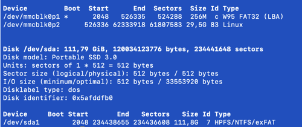
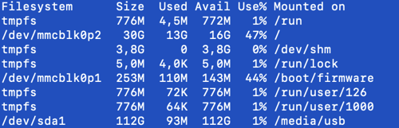

# Installation Raspberry Pi 4 WebServer
## Installation de la couche SSL :
- `sudo apt-get update`
- `sudo apt-get upgrade -y`
- `sudo apt install -y ca-certificates curl openssh-server`
- `sudo hostnamectl`

## Installation serveur WEB :
- `sudo apt-get install apache2`

## rapatriement des données de l'ancien serveur vers le nouveau :
- `sudo scp -r /Library/WebServer/Documents/agc wsayer@192.168.1.38:/tmp --> de l'ancien serveur vers le nouveau`
- `cd /var/www/html` --> sur le serveur cible (le nouveau)
- `sudo mv /tmp/agc .`
- `sudo chown -R www-data:www-data agc/`

## Installation de php la derenière version disponible pour la version d'ubuntu installé :
- `sudo apt-get install php`

## Installation de Mysql :
- `sudo apt-get install mariadb-server`
- `sudo apt-get install php-pdo`
- `sudo apt-get install php-pdo-mysql`
- `sudo systemctl restart apache2.service`
- `sudo mysql_secure_installation`
- `sudo mysql -u root -p`
- `sudo apt-get install phpmyadmin`

Allez dans phpmyadmin via le web est créer les deux bases de données sans créer de tables, nécessaire pour la restauration

## Rappatriement bases de données :
- `sudo gzip -d agc.sql.gz` 
- `sudo gzip -d media.sql.gz` 
- `sudo mysql -u root -p agc < agc.sql`
- `sudo mysql -u root -p media < media.sql`

## Installation serveur postfix :
- `sudo apt install mailutils`

## Installation de letsencrypt pour permettre la création d'un certificat serveur :
- `sudo apt-get install snapd`  --> gestionnaire de paquet qui doit déjà être installé sur la version Ubuntu 21.10
- `sudo snap install core`
- `sudo snap refresh core`
- `sudo snap install` --classic certbot
- `sudo ln -s /snap/bin/certbot /usr/bin/certbot`
- `sudo certbot --apache -d agc88.ddns.net`
- `sudo apachectl -M`
- `sudo a2enmod ssl`
- `sudo a2enmod rewrite`
- `sudo a2ensite agc.conf` 
- `sudo a2ensite agc-le-ssl.conf`
- `systemctl restart apache2 ou systemctl reload apache2`
`
## Installation de gcc et make pour permettre la compilation d'application comme no-ip :
- `sudo apt-get install gcc`
- `sudo apt-get install make`

## no-ip :
Download l'application no-ip duc sur le site de no-ip

- `sudo mv noip-duc-linux.tar.gz /usr/local/src/`
- `sudo cd /usr/local/src/`
- `sudo tar xzf noip-duc-linux.tar.gz`
- `cd noip-2.1.9-1/`
- `sudo make`
- `sudo make install`
- `Create the configuration file: /usr/local/bin/noip2 -C`

## Sur le site de no-ip, dans votre espace client, il faut lancer la configuration du host :
- No-IP Hostnames / cliquez sur Last Update après avoir créer un host.
- Une fenêtre s'affiche : **No Dynamic Update Detected for: agc.blogsyte.com**, cliquez sur le bouton **Configure Now**
- Select Hostname, cliquez sur le bouton **Next Step**
- Connection Details, remplir les champs suivants : 
  * Router Brand : livebox --> affichera : **Orange Livebox**, qu'il faut sélectionner
  * Software/device : Raspberry --> affichera : **Raspberry Pi (Web Server)**, qu'il faut sélectionner
  * Appuyez sur le bouton **Next Step**
- Is there a computer always running on your network? --> Sélectionnez **Yes**
- Sur le **Raspberry Pi 4**, veuillez suivre la procédure indiquée pour télécharger l'application **no-ip DUC**
- quand l'installation est terminée sur le **Raspberry Pi**, appuyez sur le bouton **Next Step**
- **Port Forwarding**, tester le port `80` ou `443` pour vérifier qu'ils sont bien ouvert sur le **Raspberry Pi**. 
  * Si il affiche un message vert **port 443 is open**, alors le tour est joué, votre site est dorénavant accessible de l'extérieur via une adresse publique de **no-ip**. Plutôt un nom **DNS** car l'adresse IP publique change toutes les 24 heures car c'est du DNS dynamique, **DyDNS**.

  `Àttention :` Si vous redémarrez votre **Raspberry pi**, vous serez amené à lancer la commande suivante pour que votre site web soit de nouveau accessible.
  - `sudo noip2 -C`
```
Auto configuration for Linux client of no-ip.com.

Please enter the login/email string for no-ip.com  william.sayer@wanadoo.fr
Please enter the password for user 'william.sayer@wanadoo.fr'  ************

2 hosts are registered to this account.
Do you wish to have them all updated?[N] (y/N)  y
Please enter an update interval:[30]  
Do you wish to run something at successful update?[N] (y/N)  y
Please enter the script/program name  

New configuration file '/usr/local/etc/no-ip2.conf' created.

```


## Brancher un disque dur externe en USB 3 :
### Pré-requis :
- Un disque dur formatté en **FAT** ou **NTFS** branché à votre **Raspberry Pi** en **USB**.
- Un accès SSH à votre machine.

### Installation :
- `sudo apt-get update`
- `sudo apt-get upgrade`
- `sudo apt-get install ntfs-3g`

### Configuration :
#### Identification du disque dur :
- `sudo fdisk -l`



- `sudo blkid /dev/sda1`


`/dev/sda1: LABEL="backup" BLOCK_SIZE="512" UUID="06A23944A239398F" TYPE="ntfs" PARTUUID="5afddfb0-01"`

#### Création du dossier cible :
- `sudo sudo mkdir /media/usb`
- `sudo chown -R wsayer:wsayer usb` --> droit de l'utilisateur du Raspberry Pi
- `sudo vi /etc/fstab`

Insérez la ligne suivante en indiquant l'**UUID** du disque dur USB que l'on a identifié à l'aide de la commande **blkid /dev/sda1**.\
`UUID="06A23944A239398F" /media/usb       ntfs    defaults,auto,rw,nofail 0       1`

- `sudo mount -a` --> monter le disque dur

Vérifier que le disque dur est bien monté :

- `df -h`

